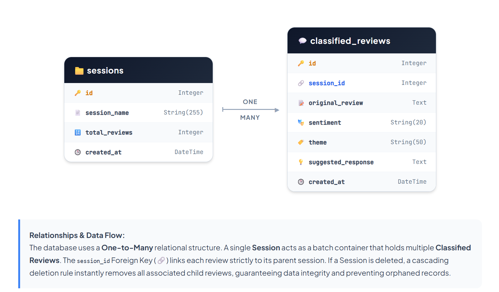

# SentiNest - Review Sentiment Center

**Live Demo:** [https://homestay-review-classifier.vercel.app/](https://homestay-review-classifier.vercel.app/)

A premium review auditing application that analyzes guest feedback (sentiment & operational themes), generates suggested management replies, and runs local model accuracy evaluations.

---

## 🚀 Quick Start

### 1. Configure Environment
1. Copy the example environment file:
   ```bash
   cp .env.example .env
   ```
2. Open `.env` and fill in your keys:
   - `GEMINI_API_KEY`: Obtain from Google AI Studio.
   - `DATABASE_URL`: PostgreSQL connection string (compatible with Supabase, neon, etc.).

## How to run backend locally

1. Create and activate a Python virtual environment:
   ```bash
   python -m venv venv
   # On Windows:
   venv\Scripts\activate
   # On macOS/Linux:
   source venv/bin/activate
   ```
2. Install dependencies:
   ```bash
   pip install -r requirements.txt
   ```
3. Run the FastAPI development server:
   ```bash
   python -m uvicorn api.index:app --port 8000 --reload
   ```

### 3. Run Frontend (React/Vite)
1. Navigate to the client directory (or use the root commands if monorepo configuration allows):
   ```bash
   pnpm install
   pnpm dev
   ```
   *Note: If you do not have `pnpm` installed, you can use `npm install` and `npm run dev`.*
   The frontend dev server proxies API calls automatically to `http://127.0.0.1:8000`.

---

## 🛠️ Tech Stack
* **Frontend**: React 19, Vite, Tailwind CSS 4, React Query, Wouter, Shadcn UI
* **Backend**: FastAPI, Python 3.9+, SQLAlchemy
* **Database**: PostgreSQL (Supabase compatible)
* **AI Model**: Google Gemini (with offline fallback heuristics)

---

## 🗄️ Database Architecture & Schema

### Database Choice and Why
We chose **PostgreSQL (via Supabase)** as our primary database over MongoDB. Since our application revolves around structured, relational data—specifically, `Sessions` that have a one-to-many relationship with `Classified Reviews`—a relational SQL database guarantees data integrity, cascading deletions, and efficient querying. We integrated **SQLAlchemy** as our ORM to handle these models safely within our Python FastAPI backend (as opposed to Prisma, which is the equivalent for Node.js). 

*(Note: The ORM schema is formally defined inside `api/index.py` using SQLAlchemy declarative base classes).*

### Schema Diagram



### Set up the database
1. Go to [Supabase](https://supabase.com), create a free project.
2. Navigate to **Project Settings → Database → Connection String**.
3. Copy the URI string (starts with `postgresql://`).
4. Paste it into your `.env` file as `DATABASE_URL`.
5. On the first startup, SQLAlchemy will automatically detect your engine and create the necessary tables (`sessions` and `classified_reviews`) if they do not already exist.

---
## ☁️ Deployment
This project is configured for **Vercel** serverless hosting. Link your repository on Vercel, set your environment variables (`GEMINI_API_KEY` and `DATABASE_URL`), and deploy.
